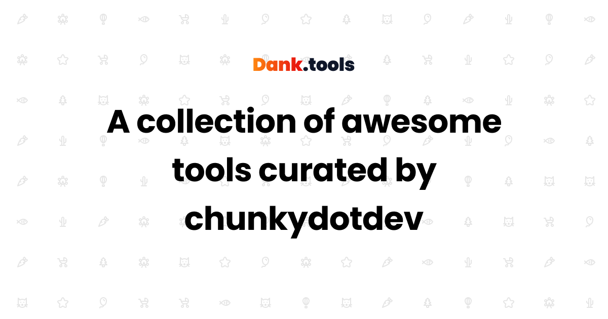

# CSS Newsletter Landing Page

A high-converting Alex Hormozi-style landing page for a CSS tips & tricks newsletter, built with Next.js and Tailwind CSS using neobrutalism design elements.



## Features

- 🎯 **High-conversion landing page** - Built with conversion principles in mind
- 🔄 **Newsletter signup** - Integrated with Buttondown for easy collection of emails
- 📊 **Analytics tracking** - Plausible analytics integration
- 📱 **Fully responsive** - Mobile-first design that works on all devices
- 🎨 **Neobrutalism design** - Bold and attention-grabbing UI with thick borders and offset shadows
- 🌐 **SEO optimized** - Proper meta tags and Open Graph data
- ⚡ **Fast loading** - Optimized for performance

## Tech Stack

- [Next.js](https://nextjs.org/) - React framework for production
- [TypeScript](https://www.typescriptlang.org/) - Static type checking
- [Tailwind CSS](https://tailwindcss.com/) - Utility-first CSS framework
- [Buttondown](https://buttondown.email/) - Newsletter service
- [Plausible](https://plausible.io/) - Privacy-friendly analytics
- [Tabler Icons](https://tabler-icons.io/) - Simple line icons

## Getting Started

### Prerequisites

- Node.js (v18 or higher)
- npm or pnpm

### Installation

1. Clone the repository:

```bash
git clone https://github.com/chunkydotdev/css-newsletter.git
cd css-newsletter
```

2. Install dependencies:

```bash
npm install
# or
pnpm install
```

3. Create a `.env.local` file in the root of the project with your API keys:

```
# Buttondown API Key
# Get your API key from: https://buttondown.email/settings/api
BUTTONDOWN_API_KEY=your_api_key_here

# Plausible Analytics Domain
PLAUSIBLE_DOMAIN=chunky.dev
```

4. Run the development server:

```bash
npm run dev
# or
pnpm dev
```

5. Open [http://localhost:3000](http://localhost:3000) with your browser to see the result.

## Analytics Integration

The landing page includes Plausible Analytics to track:

- Page views
- Newsletter sign-ups
- CTA button clicks
- Scroll depth to the sign-up form

All tracking is privacy-friendly and compliant with GDPR, CCPA, and other privacy regulations.

## Newsletter Integration

The landing page is integrated with [Buttondown](https://buttondown.email/), a simple, powerful newsletter tool for writers.

### How it works:

1. Users enter their email (and optional name) in the form
2. The form submits to the Next.js API endpoint (`/api/subscribe`)
3. The API endpoint forwards the request to Buttondown's API
4. On success, the user sees a confirmation message

## Customization

### Colors

You can modify the colors by editing the Tailwind config:

- Primary brand color: `bg-blue-600`
- Text colors: `text-gray-700`
- Border colors: `border-black`

### Fonts

The landing page uses the Poppins font with weights 400, 500, 700, and 900.

### Content

Main content areas to update:

- Hero section
- The offers (3 cards)
- Testimonials
- FAQs
- Footer links

## Deployment

This project can be easily deployed to Vercel:

[](https://vercel.com/new/clone?repository-url=https%3A%2F%2Fgithub.com%2Fchunkydotdev%2Fcss-newsletter&env=BUTTONDOWN_API_KEY,PLAUSIBLE_DOMAIN)

Make sure to add the environment variables in your Vercel project settings.

## License

This project is licensed under the MIT License - see the [LICENSE](LICENSE) file for details.

## Credits

Created by [chunky.dev](https://chunky.dev)

Follow on Twitter: [@chunkydotdev](https://twitter.com/chunkydotdev)
GitHub: [chunkydotdev](https://github.com/chunkydotdev)
